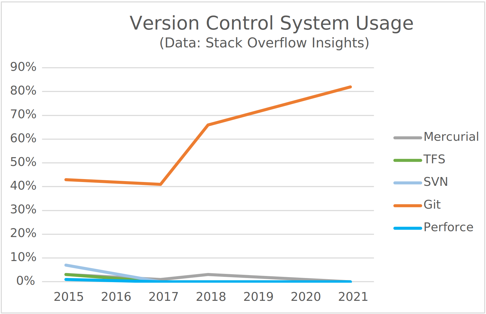

<!--

author:   Central Research Data Management of Kiel University
email:    fdm@rz.uni-kiel.de
version:  1.0.0
language: en
narrator: UK English Female

icon:     assets/images/cau-norm-en-lilagrey-rgb.png

logo:     https://git-scm.com/images/branching-illustration@2x.png

comment:  Online course for getting started with the version control system Git
          and the open source software development platform GitLab.

script:   https://s.plantuml.com/synchro2.min.js

@plantUML : @plantUML.exec(svg,```@0```)

@plantUML.svg: @plantUML.exec(svg,```@0```)

@plantUML.png: @plantUML.exec(png,```@0```)

@plantUML.exec
<script run-once modify="false">
function draw(type, code, counter = 10) {
  try {
    let s = unescape(encodeURIComponent(code));
    var arr = [];
    for (let i = 0; i < s.length; i++) {
      arr.push(s.charCodeAt(i));
    }
    let compressor = new Zopfli.RawDeflate(arr);
    let compressed = compressor.compress();
    let dest = "https://www.plantuml.com/plantuml/" + type + "/" + encode64_(compressed);
    send.html("")
    send.stop()
  } catch(e) {
    if (counter > 0) {
      setTimeout(draw(type, code, counter - 1), 100)
    } else {
      send.stop()
    }
  }
}

draw("@0", `@1`)
</script>

<span>

</span>
@end

@plantUML.eval
<script>
function draw(type, code, counter = 10) {
  try {
    let s = unescape(encodeURIComponent(code));
    var arr = [];
    for (let i = 0; i < s.length; i++) {
      arr.push(s.charCodeAt(i));
    }
    let compressor = new Zopfli.RawDeflate(arr);
    let compressed = compressor.compress();
    let dest = "https://www.plantuml.com/plantuml/" + type + "/" + encode64_(compressed);
    console.html("")
    console.log(dest)
    send.lia("LIA: stop")
  } catch(e) {
    if (counter > 0) {
      setTimeout(draw(type, code, counter - 1), 50)
    } else {
      send.lia("LIA: stop")
    }
  }
}

draw("@0", `@input`)
""
</script>
@end

-->

# Versionieren mit Git: We Git you started!

**Thilo Paul-Stüve, Britta Petersen**

Central Research Data Management, Kiel University

> To see this document as an interactive LiaScript rendered version, click on the
> following link/badge:
>
> [](https://liascript.github.io/course/?https://raw.githubusercontent.com/BrittaP/rdm4CAU/main/Git_CoffeeLecture.md)
>
> [qr-code](https://liascript.github.io/course/?https://raw.githubusercontent.com/BrittaP/rdm4CAU/main/Git_CoffeeLecture.md)
>
> If you need help, feel free to ask us any reasonable question: [fdm@rz.uni-kiel.de](mailto:fdm@rz.uni-kiel.de)
>
> 
> This work is licensed under a [Creative Commons Attribution 4.0 International License](http://creativecommons.org/licenses/by/4.0/).

## Agenda

During the next 45 minutes we will look at the following:

- Introduction to Git
- CAU Gitlab Version Management Service
- Suggestions for Further Self-Studies
- Open Questions & Feedback


## Goals & limitations of this Coffee Lecture

 <!-- width="90px" align="right" -->

*At the end of this Coffee Lecture you should*

- have an idea of the general concept of versioning with Git and can recall some important related terms.
- be able to find [CAU Gitlab](https://cau-git.rz.uni-kiel.de) and know what to do to be able to use this service.
- know where to head next to make you even more familiar with git.
- hopefully had a good coffee/tee in a nice and motivating atmosphere!

---
 <!-- width="110px" align="right" -->

We will show only a very small fraction of what there is to know about working with Git and GitLab.

*We will neither demonstrate nor touch*

- Git installations
- Working with command line or GUI clients
- Further advanced Git operations
- Subject-specific issues


## Introduction to Git: What is Version Management?

* Keeping different variations of something in a comprehensible way.

  * Mostly files, in context of computers
  * Example:

    ```console
    File vl.txt
    File v2.txt
    ```

* Complex, if working with several people on the same thing at different locations

  * How to deal with editing conflicts?
  * How to deal with related files distributed in complex file hierarchies?
  * Manifold of creative approaches to file naming and version numbers
  * E-mail server as storage system

## Introduction to Git: Version Control Systems

- **Version Control Systems (VCS)** try to solve the **technical** problems of collaborative editing

  - Early 1980s: Shared file systems with locks on files, e.g., Revision Control System
  - Early 2000s: Client-Server-Solutions introducing a central workspace, _branches_ and _tags_, e.g., Subversion
  - Mid 2000s: **Distributed Version Control Systems (DVCS)**, e.g., Mercurial, Git

- DVCSs are currently state of the art for version management

  - Peer-to-peer architecture
  - Means for conflict resolution

- Architectures: Peer-to-Peer vs Client-Server

```text @plantUML
@startuml

[Central Repository] .. [Client 1]
[Central Repository] .. [Client 2]
[Central Repository] .. [Client 3]

note top of [Central Repository]: Client-Server

[Repository 1] .down. [Repository 2]
[Repository 1] .down. [Repository 3]
[Repository 1] .down. [Repository 4]
[Repository 2] .down. [Repository 3]
[Repository 2] .down. [Repository 4]
[Repository 3] .right. [Repository 4]

note top of [Repository 1]: Peer-to-Peer
@enduml
```

## Introduction to Git: What is Git?

 <!-- align=right -->

* Warning: **Git is a complex beast**
* Open Source DVCS developed by Linus Torvalds (guy in the picture on the right[^1]) for Linux-Kernel development
* Developed for

  * Collaboration of lots of people from all over the world
  * Managing huge amounts of text files (source code files)
  * Managing changes that concern multiple files in complex hierarchies
  * Exploring (and discarding) different approaches of development
  * Managing different variants and releases

[^1]: Picture of Linus Torvalds: Lf Asia, CC-BY 3.0 unported

## Introduction to Git: What about other VCS?

<!-- style="max-width: 700px; display: block; margin: auto; padding-top:50px;" -->

## Introduction to Git: Git is Flexible

* **Basic idea**

  > Your repository is on your computer and you can bring it into sync with other repositories (maybe somewhere else).

  ```text @plantUML
  @startuml
  [Repository 1] .down. [Repository 2]
  [Repository 1] .down. [Repository 3]
  [Repository 1] .down. [Repository 4]
  [Repository 2] .down. [Repository 3]
  [Repository 2] .down. [Repository 4]
  [Repository 3] .right. [Repository 4]
  @enduml
  ```

{{1}}
********************************************************************************

* You are able to work without internet access

  * Work on your own and sync later
  * Work in a small team and sync only locally, e.g., LAN or memory stick
  * Sync to repositories, e.g., send to you be snail mail ✉️

********************************************************************************

{{2}}
********************************************************************************

* You are able to work with internet access

  * Sync to other repositories over the internet
  * Continuously sync to one central repository over the internet

********************************************************************************

{{3}}
********************************************************************************

* You may combine all of the above
* Most common scenario:

  > Multiple local repositories are synchronised with one central repository as the truth.

********************************************************************************

## Introduction to Git: Git is Simple

**Working with a Git repository is – in principle – very simple**

  1. You make additions and changes in your workspace
  2. You add the changes you want to put in your repository to the index
  3. You commit these changes to the repository, specifying the topic of the changes
  4. You may refer to this later, push it somewhere else, or can continue with 1.

```text @plantUML
@startuml
folder evilAI
folder code
folder data
file advancedReasoning.lisp #pink
file unconscionableAI.lisp
file googleDump.csv
file facebookDump.csv
evilAI -- code
evilAI -- data
code -- advancedReasoning.lisp
code -- unconscionableAI.lisp
data -- googleDump.csv
data -- facebookDump.csv
@enduml
```

(The repository information is stored in a hidden folder in the repository directory)

{{1}}
********************************************************************************

**How Does This Work**

* When directories and files in your workspace are added to the _index_, they are transformed to _trees_ and _blobs_ and are put on the list for the next commit

********************************************************************************

{{2}}
********************************************************************************

**_Blobs_**

* Represent a file with a name specific content
* They contain the filename, the contents and have an ID

  ") <!-- width=300px -->

* Git command: [git ls-files](https://git-scm.com/docs/git-ls-files) (just FYI, you want need this very often)

[^2]: S. Humphreys, Australian Museum, Public Domain.

********************************************************************************

{{3}}
********************************************************************************

**_Trees_**

* Represent the directory hierarchy
* They refer to _blobs_ and have an ID

  ") <!-- width=500px -->

* Git command: [git ls-tree](https://git-scm.com/docs/git-ls-tree) (again just FYI)

[^3]: Photo by [Parsing Eye](https://unsplash.com/@parsingeye) on [Unsplash](https://unsplash.com/s/photos/dead-tree) (Free to use under Unsplash licence)

********************************************************************************

{{4}}
********************************************************************************

** Index**

* Represent the list of contents for the next commit to your repository
* Refers to the _tree_ and _blobs_ you added
* You may change the _index_ by adding or removing files and folders until you commit
* So, when you add your _Workspace_ directory hierarchy and some files to the _index_, this happens:

   <!-- width=500px -->

* Git command: [git add](https://git-scm.com/docs/git-add)

********************************************************************************

{{5}}
********************************************************************************

**Commits**

* Have a _message_, an ID, contain a _tree_ with _blobs_ and refer to a previous commit.
* When you commit, you practically add your tree with blobs from the index to to your repository
* You add a short comment so that everyone knows what changes this commit represents
* This is what happens:

  

* Git command: [git commit](https://git-scm.com/docs/git-commit)

********************************************************************************

{{6}}
********************************************************************************

* Your history of commits:

   <!-- width=300px -->

* Git command: [git log](https://git-scm.com/docs/git-log)

********************************************************************************

## Introduction to Git: Tags and Branches

**Tags**

* When you want to mark a specific _commit_ for later reference, you can tag it

  * You can, e.g., mark a commit, that represents a  version of your work, such as '1.0.0' or 'preprint'

* _Tags_ have a name and always refer to the same _commit_, unless you change it yourself

   <!-- width=200px -->

* Git command: [git tag](https://git-scm.com/docs/git-tag)

{{1}}
********************************************************************************

**Branches**

* When you work with a git repository you always work in a _branch_

  * The default _branch_ is called 'main'

* When you want to bring on a development undisturbed, want to test something without making your collaborators problems, you can make a new _branch_ for this
* Common are _branches_ for

  * A _branch_ for a working version (often the 'main' _branch_)
  * A _branch_ for development (often called 'development')
  * A _branch_ for new features (normally named after the feature that is realised)

* _Branches_ are like tags and have a name and refer to a commit, but a _branch_ name always refers to the latest _commit_
* You can _merge_ _branches_ by including all commits the branch to merge in the current branch (and deal with the conflicts)

    <!-- width=250px -->

* Git commands: [git branch](https://git-scm.com/docs/git-branch) and [git merge](https://git-scm.com/docs/git-merge)

********************************************************************************

## Introduction to Git: Git Usage

**In reality, Git lives on the command line**

```console
$ git --help
usage: git [--version] [--help] [-C <path>] [-c <name>=<value>]
         [--exec-path[=<path>]] [--html-path] [--man-path] [--info-path]
         [-p | --paginate | -P | --no-pager] [--no-replace-objects] [--bare]
         [--git-dir=<path>] [--work-tree=<path>] [--namespace=<name>]
         [--super-prefix=<path>] [--config-env=<name>=<envvar>]
         <command> [<args>]

These are common Git commands used in various situations:

start a working area (see also: git help tutorial)
  clone             Clone a repository into a new directory
…
'git help -a' and 'git help -g' list available subcommands and some
concept guides. See 'git help <command>' or 'git help <concept>'
to read about a specific subcommand or concept.
See 'git help git' for an overview of the system.
```

{{1}}
********************************************************************************

* [Download Git for your operating system](https://git-scm.com/downloads)
  [qr-code](https://git-scm.com/downloads)

********************************************************************************

{{2}}
********************************************************************************

**Command Overview**

```text @plantUML
@startuml
Workspace -> Index: git add <file> …
Index -> Repository: git commit -m "message"
Workspace <- Repository: git checkout <branch>
Repository -> "Remote Repository": git push
Repository <- "Remote Repository": git fetch
Workspace <- Repository: git merge <commit>
Workspace <- "Remote Repository": git pull
@enduml
```

********************************************************************************

{{3}}
********************************************************************************

* For further information refer to the Git Documentation Reference: [git add](https://git-scm.com/docs/git-add), [git commit](https://git-scm.com/docs/git-commit), [git checkout](https://git-scm.com/docs/git-checkout), [git push](https://git-scm.com/docs/git-push), [git fetch](https://git-scm.com/docs/git-fetch), [git checkout](https://git-scm.com/docs/git-checkout), [git merge](https://git-scm.com/docs/git-merge), [git pull](https://git-scm.com/docs/git-pull)
  [qr-code](https://git-scm.com/docs/git#_git_commands)

********************************************************************************

{{4}}
********************************************************************************

**There are 3rd-party clients for using Git**

* More integrated in your **computer's GUI**, e.g.,

  * [GitKraken](https://www.gitkraken.com) (GNU/Linux, MacOS, Windows)
  * [SourceTree](https://www.sourcetreeapp.com) (MacOS, Windows)
  * [TortoiseGit](https://tortoisegit.org) (Windows)

********************************************************************************

{{5}}
********************************************************************************

* **Web GUIs**, e.g.,

   <!-- align=right width=450px -->

  * [Gitea](https://gitea.io) (on premise)
  * [GitHub](https://github.com) (SaaS, on premise)
  * [GitLab](https://gitlab.com) (SaaS, on premise)
  * [Gogs](https://gogs.io) (on premise)

********************************************************************************

## CAU Gitlab Version Management Service: What is GitLab?

 <!-- width="250px" align="right" -->

**[GitLab](https://about.gitlab.com/) is a Git-based fully integrated platform for software development that provides complete DevOps and project management solutions.**

- GitLab is open source.
- GitLab is provided by GitLab Inc., that runs [GitLab.com](https://about.gitlab.com/) on a freemium basis and offers a subscription service.
- GitLab can be provided on premise.

{{1}}
********************************************************************************

<!-- style="max-width: 700px; display: block; margin: auto; padding-top:50px;" -->

********************************************************************************

## CAU Gitlab Version Management Service: GitLab Features

GitLab offers several features that make it easier to collaborate with others.

{{1}}
********************************************************************************

**Projects:**

In GitLab, you can create projects that allow you to host your codebase.

In addition of the *Git repository* itself a project includes some project management facilities:

- issue tracking: collect the things that still have to be done
- merge requests: someone wants to add something; here you can discuss and add the changes to your repository
- wiki: document what you are doing in your project
- …

********************************************************************************

{{2}}
********************************************************************************

**Groups:**

A group is a collection of several projects.

- If you organize your projects under a group, it works like a directory.
- You can manage your group member’s permissions and access to each project in the group.

********************************************************************************

{{3}}
********************************************************************************

**Subgroups:**

Subgroups are nested or hierarchical groups.

- Allow you to have up to 20 levels of groups.
- You can consider subgroup as a subdirectory.

********************************************************************************

## CAU Gitlab Version Management Service: Gitlab at CAU

> **The Computing Centre of Kiel University centrally operates the Git service [Gitlab RZ CAU](https://cau-git.rz.uni-kiel.de/) for CAU facilities.**
>
> The service can be booked by working groups for research work.
>
> You can access the service at [https://cau-git.rz.uni-kiel.de/](https://cau-git.rz.uni-kiel.de/).
>
> [qr-code](https://cau-git.rz.uni-kiel.de/)
>
> To log in you need your
>
> - RZ-LDAP username (e.g. *szrzs123*, *sughi456* etc.)
> - Password

{{1}}
********************************************************************************

**Terms of Service:**

If you are registering for the first time, you must agree to the *Terms of Service*.

<!-- style="max-width: 550px; display: block; margin: auto;" -->

********************************************************************************

{{2}}
********************************************************************************

**Get a Project Area**

The Computing Centre of Kiel University sets up project groups upon application.

- Eligible for application are the heads of the facilities known to the Computing Centre.
- For each project group, one or more administrators can be defined, who are initially assigned to new project groups.
- Within project groups, group administrators can independently

  - create new projects
  - delete projects
  - assign rights to any user (with valid RZ-LDAP identification)

- Further administration of rights to subordinate groups and projects is carried out by the project administrators.

********************************************************************************

## Suggestions for Further Self-Studies

If you want to go on learning about Git and get started in practice, have a look at the following.

**Things to Read**

* The whole bunch, very exhaustive, but maybe not the first thing to read. Nevertheless a good reference handbook: [Git Documentation - Reference](https://git-scm.com/docs)
* Read more about the underlying concepts of Git, very recommended by Thilo: [Git from Bottom Up](https://jwiegley.github.io/git-from-the-bottom-up/)

**Interactive Stuff**

* A game that lets you get a better understanding of your Git repository: [Oh my Git!](https://ohmygit.org/)
* An interactive tutorial that teaches you all about branching, very recommended: [Learn Git Branching](https://learngitbranching.js.org)

## Open Questions & Feedback

 <!-- width="110px" align="right" -->

> Time for questions and discussion!
>
> We are happy about feedback and suggestions for improvement or further topics you would like to hear about.
