<!--

author:   Central Research Data Management of Kiel University
email:    fdm@rz.uni-kiel.de
version:  0.1.0
language: en
narrator: UK English Female

icon:     images\cau-norm-en-lilagrey-rgb.png

logo:     https://git-scm.com/images/branching-illustration@2x.png

comment:  Presentation for full day workshop "Introduction to Research Data Management" for PhDs

script:   https://cdn.jsdelivr.net/npm/mermaid@9.1.1/dist/mermaid.min.js

@mermaid
<script run-once="true" modify="false">
mermaid.initialize({});

var svg = mermaid.render('io9wuwzxt',`@0`.replace(/\\n/g, "\n"),
function(g) {
    return true;
})

"HTML: " + svg
</script>
@end

script:   https://s.plantuml.com/synchro2.min.js

@plantUML : @plantUML.exec(svg,```@0```)

@plantUML.svg: @plantUML.exec(svg,```@0```)

@plantUML.png: @plantUML.exec(png,```@0```)

@plantUML.exec
<script run-once modify="false">
function draw(type, code, counter = 10) {
  try {
    let s = unescape(encodeURIComponent(code));
    var arr = [];
    for (let i = 0; i < s.length; i++) {
      arr.push(s.charCodeAt(i));
    }
    let compressor = new Zopfli.RawDeflate(arr);
    let compressed = compressor.compress();
    let dest = "https://www.plantuml.com/plantuml/" + type + "/" + encode64_(compressed);
    send.html("")
    send.stop()
  } catch(e) {
    if (counter > 0) {
      setTimeout(draw(type, code, counter - 1), 100)
    } else {
      send.stop()
    }
  }
}

draw("@0", `@1`)
</script>

<span>

</span>
@end

@plantUML.eval
<script>
function draw(type, code, counter = 10) {
  try {
    let s = unescape(encodeURIComponent(code));
    var arr = [];
    for (let i = 0; i < s.length; i++) {
      arr.push(s.charCodeAt(i));
    }
    let compressor = new Zopfli.RawDeflate(arr);
    let compressed = compressor.compress();
    let dest = "https://www.plantuml.com/plantuml/" + type + "/" + encode64_(compressed);
    console.html("")
    console.log(dest)
    send.lia("LIA: stop")
  } catch(e) {
    if (counter > 0) {
      setTimeout(draw(type, code, counter - 1), 50)
    } else {
      send.lia("LIA: stop")
    }
  }
}

draw("@0", `@input`)
""
</script>
@end

-->

# Welcome

**Britta Petersen, Thilo Paul-Stüve**

Central Research Data Management of Kiel University

>**Disclaimer**:Please note that you are leaving the CAU pages once you open this presentation in your brwoser. This presentation includes links to other third party websites and services. When you click on these links you will leave this presentation and will be redirected to respective another site. These sites are not under our control.
>
>RDM@CAU is not responsible for the content of linked third party websites. Please be aware that the security and privacy policies on these sites may be different than CAU policies, so please read third party privacy and security policies closely. 
>
>By clicking on the CONTINUE button below, you acknowledge the above statement and will be taken to the linked site. If you want to remain on Klein Tools' site, select the CANCEL button.
> To see this document as an interactive LiaScript rendered version, click on the
> following link/badge:
>
> [](https://liascript.github.io/course/?https://cau-git.rz.uni-kiel.de/fdm/schulungen/git-einfuehrung/-/raw/main/course.md)
>
> If you need help, feel free to ask us any questions:
>
> [fdm@rz.uni-kiel.de](mailto:fdm@rz.uni-kiel.de)
>
> ____________________________________________
>
>  This work is licensed under a [Creative Commons Attribution 4.0 International License](https://creativecommons.org/) with exception of the used material from other copyright holders.


## Please be nice!

Some rules for today:

<div style="float:left; width:60%;">
  <p>

* Please mute your microphone when you do not have the floor

* Please hear each other out and let each other finish

* Draw attention to yourselves when you want to say something

* Please help each other

* Please do not do anything on the side

* Please ask if you have not understood something

* Please contribute actively

* Please allow mistakes -> positive culture of mistakes.

</p>


</div>

<div style="float:right; width:40%;">
  
    <sub style="text-align: right;">Source: Pixabay</sub>
</div>

## Goals today
At the end of the workshop you…

<div style="float:left; width:60%;">
  <p>

- have a basic idea of the general concept of RDM and know some important related terms.

- can describe what research data is and know the research data lifecycle.

- can explain the importance of documentation and know what metadata is.

- can identify and assess data formats.

- can distinguish back up and long-term storage.

- can describe the FAIR-principles.

- can describe what a DMP is.

- know the requirements of funders and RDM related CAU contacts.

- had some time to exchange with peers.

- hopefully also had some fun!

</p>

</div>

<div style="float:right; width:30%;">
  
  <sub><span style="text-align: right;">Source: Cleo Michelsen</span></sub>
</div>

## Agenda

Let us have a look at our workload for today:

<div style="float:left; width:60%;">
  <p>

- Expectations
- Research data and research data management
- Research data lifecycle
- Data organisation
- Documentation & metadata
- Data formats

  ***LUNCH BREAK***

- Back up & long-term storage
- FAIR principles and Open X
- Data publication
- Data management plan (DMP)
- RDM related organisations & funder requirements
- RDM @ CAU

</p>

</div>

<div style="float:right; width:30%;">
  
  <sub><span style="text-align: right;">Source: Pixabay</span></sub>
</div>


## Warm up!

<!--
style="width: 15%; max-width: 600px; float:right"
title="puzzle"
onclick="alert('Let´s play!');"
-->

>Let us play a game…
>
>Hide your camera (use a sticker or your finger).
>
>I will read statements to you.
>
>Each time you can agree with the statement show yourself and waive.
>
>That´s it !

{{1-2}}
********************************************************************************

><p style="color:#9a047f">I like to drink coffee in the morning.</p>

********************************************************************************

{{2-3}}
********************************************************************************

><p style="color:#9a047f">I am working in the field of nature science.</p>

********************************************************************************

{{3-4}}
********************************************************************************

><p style="color:#9a047f">If I have to decide to go to the cinema or to a concert, I decide for the concert.</p>

********************************************************************************

{{4-5}}
********************************************************************************

><p style="color:#9a047f">I am working in a field of the humanities.</p>

********************************************************************************

{{5-6}}
********************************************************************************

><p style="color:#9a047f">I know the FAIR data principles.</p>

********************************************************************************

{{6-7}}
********************************************************************************

><p style="color:#9a047f">I am working in a field of engeneering</p>

********************************************************************************

{{7-8}}
********************************************************************************

><p style="color:#9a047f">I have an ORCID.</p>

********************************************************************************

{{8-9}}
********************************************************************************

><p style="color:#9a047f">I have a pet (or more that one).</p>

********************************************************************************

{{9-10}}
********************************************************************************

><p style="color:#9a047f">I am using open data for my research work.</p>

********************************************************************************

{{10-11}}
********************************************************************************

><p style="color:#9a047f">I am working with personal data.</p>

********************************************************************************

{{11-12}}
********************************************************************************

><p style="color:#9a047f">I am teaching students next to my PhD.</p>

********************************************************************************

{{12-13}}
********************************************************************************

><p style="color:#9a047f">I am writing code for my PhD.</p>

********************************************************************************

{{13-14}}
********************************************************************************

><p style="color:#9a047f">I was sent to this workshop by my supervisor and really don´t know what am I supposed to do here.</p>

********************************************************************************

## Expectations
We would like to know a little bit more about your expectations and your fears regarding this workshop.

> **Group work**:
>
> Collect your ***hopes/wishes***<!-- style='color: #9a047f' --> and your ***fears***<!-- style='color: #9a047f' --> regarding this workshop, using oncoo cards.
>
> https://www.oncoo.de/0fou

### Review Expectations
<iframe src="https://www.oncoo.de/t/0fou" style="border:0px;width:100%;height:500px" allowfullscreen="true" webkitallowfullscreen="true" mozallowfullscreen="true"></iframe>

 <!-- width="100px" align="right" -->

## Research data and research data management

<!--
style="width: 20%; max-width: 100px; float:right; margin: 10px;"
title="puzzle"
onclick="alert('What do you think?');"
-->

>**Which aspects belong to the topic "research data management?"**
>
> Today you are supposed to learn something about research data management. What do you think: Which aspects belong to the topic?
>
>**Let's collect together!**
>
> Enter words that you associate with the term "research data management". You may enter as many words as you like: https://answergarden.ch/3005403

---

{{1}}
********************************************************************************

<iframe src="https://answergarden.ch/3005403" style="border:0px;width:100%;height:500px" allowfullscreen="true" webkitallowfullscreen="true" mozallowfullscreen="true"></iframe>


********************************************************************************

### Research Data Management

{{0-3}}
****************

What is research data management?
---
****************

{{1-3}}
****************
> ‘Research data management is an explicit process covering the creation and stewardship of research materials to enable their use for as long as they retain value.’
>
>[DCC Glossary](http://www.dcc.ac.uk/digital-curation/glossary#R)

****************

{{2-3}}
****************
> ‘Research Data Management (RDM) is the methodical handling of the information produced or re-used during the course of academic research.’
>
>[University of Edinburgh Research Data Service](https://www.ed.ac.uk/information-services/research-support/research-data-service/research-data-management)

******************

{{4-6}}
What do you think is the benefit of good research data management?
---

{{5-6}}
***************
>**Think-Pair-Share**
>
>You will have some minutes with your partner.  Please discuss!
>
>- What might be the benefit of research data management?
>
>Share your thoughts with us when you are back!

****************

{{6-7}}
********************
The benefits of good research data management are...
---
- Reproducibility of results
- Findability of the data
- Traceability of research
- Transparency of research
- Quality assurance and quality attribute
- Efficiency in the research process
- Sustainability
- Knowledge generation
- No redundancy
- Structuring, organisation
- Enable collaborations
- …
- …
****************

### Research Data

>**Group work**:
><!--
style="width: 20%; max-width: 800px; float:right"
title="puzzle"
onclick="alert('Let´s work together!');"
-->
>
>Find out with what kind of data your group members are working with.
>
>Together, add everything that you think can be research data to your collection.
>
>Please use the following pads to take notes during break out session:
>
>https://zumpad.zum.de/p/2023-01-26_research-data_G1
>
>https://zumpad.zum.de/p/2023-01-26_research-data_G2
>
>https://zumpad.zum.de/p/2023-01-26_research-data_G3
>
>https://zumpad.zum.de/p/2023-01-26_research-data_G4

---

{{1}}
**********
What are research data?
---

> _‘In short data means whatever is necessary to validate or reproduce your research findings, or to gain a richer understanding of them.’_
>
>[University of Edinburgh Research Data Service](https://www.ed.ac.uk/information-services/research-support/research-data-service/research-data-management)

**********

{{2}}
***********
> _‘Any information you use in your research.‘_
>
>[University of Camebridge PrePARe Project](https://www.repository.cam.ac.uk/handle/1810/243750)

************

{{3}}
***************
> _‘All researchers work with data and/or datasets, but what you call data will depend on your discipline. As a humanities scholar you might talk about your primary sources or texts. If your research is in a social science, you may think in terms of survey results, interviews and statistics. You will probably have different terms again for the outputs of your experiments and observations if you are a scientist.’_
>
>[Monash University Library Data Management Brochure](https://www.monash.edu/__data/assets/pdf_file/0010/185869/data-management-brochure.pdf)

**************


### Examples for Research Data
 <!-- width="350px" align="right" -->

- Audio and video recordings
- Diaries
- Geographic information system (GIS) data
- Laboratory and field notebooks
- Model, script and research software code
- Pictures and figures
- Questionnaires and codebooks
- Samples and artifacts
- Sensor data
- Sequence data
- Spectra
- Text and spreadsheet documents
- Text corpora and annotations
- Topography data
- Transcripts


## BREAK
<center>

**Have a break!**


</center>

## Research data lifecycle

<center>
{{0-1}}
************
 <!-- width="500px" -->


************
</center>

{{1}}
************

 <!-- width="300px" align="right" -->

Individual work:
---

Think about your own PhD project and add keywords to the stations of the research data lifecycle that describe what steps and procedures at each station are relevant to your research data.

Find your workspace here: https://miro.com/app/board/uXjVPvwAFbI=/

-> Does this research data lifecycle fit to your research project?

-> Are there any deviations?

You´ll have 15 Minutes.

************

## Data organisation

<div style="text-align:center">
><p style="color:#9a047f">**It may seem trivial, but structured folder and file naming is a first step in research data management!**</p>
</div>

<center></center>

<div style="text-align:center">
<P><SMALL>https://xkcd.com/1459. Shared under CC-BY-NC License</SMALL></P>
</div>


### Organize your Files

- Try to find meaningful names ➞ no “fantasy names”
- Use a uniform scheme and a logical structure

  - Folder structure and file names

  - Hierarchic order with first things first

  - Think about your preferences in ___sorting!___

- Follow ***ISO 8601*** for dates and times

  - Date & time, e.g., YYYYMMDDThhmmss±hhmm

  - Date, e.g., YYYY-MM-DD

- Versions? Use the semantic versioning scheme (Major.Minor.Patch), e.g., 2.0.0

- Avoid of blanks and special characters  “🦄”

- ***Document*** your naming conventions and abbreviations used

  -  Readme.md

### Examples for Naming Conventions

{{0-1}}
********************************************************************************

**Example for a folder hierarchy**

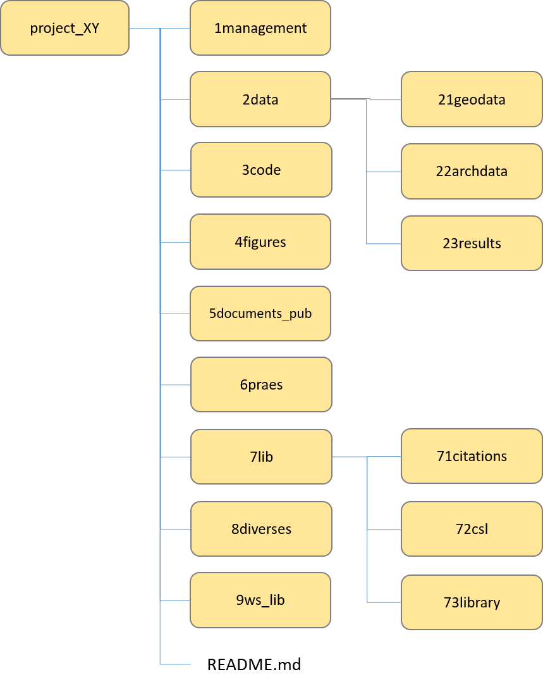<!-- width="350px" -->

********************************************************************************

{{1-2}}
****************************************

>**Example for a file name following a naming convention**
>
>[Project name]\_[Approach]\_[Location]\_[Person-ID]_[Date].[Format-Suffix]
>
>Rebel-Hunting\_Interview\_DS-1-Orbital-Battle-Station\_Organa\_1976-05-25.mp4

****************************************

### Which one is a good name?

Which examples are following a good naming convention?

- Olga\_170413_probe17k
- Naturepaper-marc-mira-ready!
- Vm4520132Schmidt.pdf
- Kristall\_765\_spektr\_2016-12-03.csv
- 170413\_probe17k\_olga
- Naturepaper+karl+britta+james&nal
- Olga170413probe17k
- Krst\_765\_spkt\_161203
- Naturepaper+karl+britta+james ready!\_revised
- 012\_maus\_mrna\_20200912
- Nature\_karl&jan\_endendversion
- 28q8QGlHKwrRw.pdf
- Tagung\_Digitale\_Wissenschaft.pdf
- 647749157 .pdf


### Version Control

{{0-1}}
********************************************************************************

<center></center>


********************************************************************************

{{1-2}}
********************************************************************************

- Store versions in separate files

  - Semantic versioning (Major.Minor.Patch), e.g.,

    - __0.1.0__ (a beta)

    - __1.0.0__ (a release version)

    - __1.0.1__ (a release with slight corrections)

  - can be included in file names

  - define what you consider to be a "release" or a "slight correction"

- Document your versioning scheme and constantly document your changes

  - Readme.md

  - Version control table

  - Data dictionary

- Working in a team? A lot of changes? Use a distributed version control system!

  - Git

  - GitLab, GitHub

---

********************************************************************************

{{2-3}}
********************************************************************************

**What a version control table could look like**

| Versionsnr.  | Changes                      | Date      | changed by |
| :----------  | :----------                      | ---        | ---               |
| 1.0          | Release                         | 2016-11-2  | KL                |
| 1.1          | Erased spelling mistakes  | 2016-11-20 | KL                |
| 1.2          | Changed layout            | 2017-02-20 | GN                |
| 2.0          | Add new chapter (3.1.) | 2017-02-20 | GN                |

********************************************************************************

{{3-4}}
********************************************************************************
**Example for Version Information within a document:**
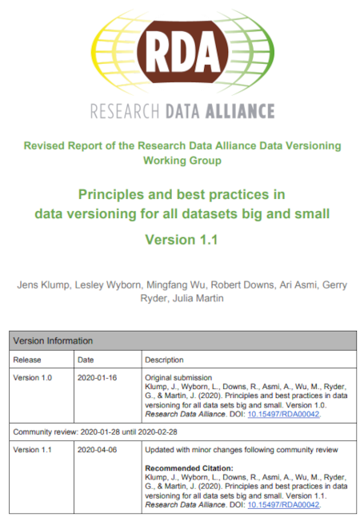

********************************************************************************

{{4}}
********************************************************************************

**Example for a documented versioning scheme:**


https://zenodo.org/record/6076538#.Y4pE63bMJPa

********************************************************************************

### Develop a naming convention

>__Individual work or group work for people working on the same project__
><!--
style="width: 20%; max-width: 800px; float:right"
title="working"
onclick="alert('Individual work');"
-->
>
>What would be a good folder structure and a good file naming convention for the files related to your PhD project?
>
>__Please document__
>
>1. to which files your folder structure and your naming convention applies
>
>2. a scratch of a folder structure
>
>3. the descriptive aspects to be used in file names and their order
>
>4. the abbreviations used
>
>5. the versioning scheme, if applicable
>
>Create an own zumpad or use your working space on the miro-Board to take notes.

## BREAK
<center>

**Have a break!**


</center>


# Data documentation

{{0-2}}
*********

<!--
style="width: 20%; max-width: 800px; float:right"
title="puzzle"
onclick="alert('Let´s work together!');"
-->

>**Group work**:
>
>You are working in a research groupgroup working on the ecology of forest stands and take over data from a previous project: [av_D.csv](http://av_D.csv)
>
>* Speculate what kind of data it could be.
>
>Discuss and take notes
>
>* Apart from the data itself, what information do you need to be able to work with a dataset?
>
>* What do you notice about the data quality?

*********

{{1-2}}
*********

<!--
style="width: 20%; max-width: 800px; float:right"
title="puzzle"
onclick="alert('Let´s work together!');"
-->

**A good data documentation should include**
---

- Information on the collection of data

    - Methods, units, time periods, locations, technique used, etc.

- Structure of the data and their mutual relationships

- Explanation of variables, labels and codes

- Differences between different data set versions

- Measures for data cleaning

- Information on access and terms of use

    - Licensing

- Ideal world

    - Description of the research undertaking

      - Goals

    - Hypotheses

**************

{{2-4}}
********************************************************************************

**Short research assignment**:

Which guideline of the **DFG Guidelines for Good Scientific Practice** deals with ***documentation***?

********************************************************************************

{{3-4}}
********************************************************************************

><p style="color:#9a047f">**Guideline 12: Documentation**
„Scientists and scholars shall document all information relevant to the achievement of a research result as comprehensibly as it is necessary and appropriate in the concerned scientific field in order to be able to verify and evaluate the result. […]“
</p>
>
><P><SMALL>Deutsche Forschungsgemeinschaft. (2019). Leitlinien zur guten wissenschaftlichen Praxis. Kodex. http://doi.org/10.5281/zenodo.3923602, S. 17.  
</SMALL></P>

********************************************************************************


### Understanding Data
<div style="float:left; width:30%;">
  <p>

> __Date:__ 364.07

{{2-3}}
***********

 <!--
style="width: 40%" -->

***********

{{3-4}}
******************

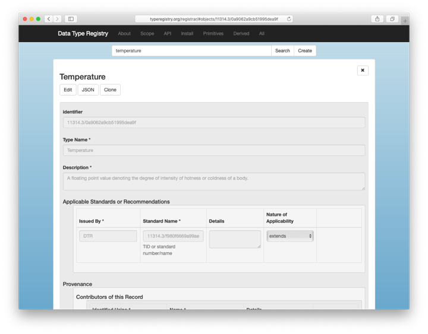

******************

{{4-5}}
*******************


*******************

{{5-6}}
*******************
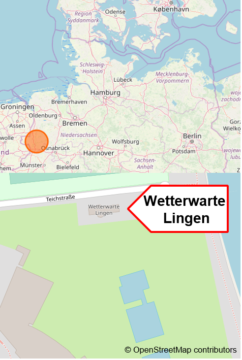

*******************

{{6-7}}
*************


 <!--
style="width: 40%" -->

*******************

</p>

</div>

<div style="float:right; width:60%;">

{{1-2}}
***********
Data about Data

- Identifier: 10.1594/dwd-weather-data
- Identifier Type: DOI
- Unit: K
- Data Type Identifier: 11314.3/0a9062a9cb51995dea9f
- Date: 2019-07-25T15:00:00Z
- Location: 52.5178687 7.3057642
- Creator: Deutscher Wetterdienst
- ROR: 02nrqs528

***************

{{2-3}}
*************
Origin, Location and Meaning of Data

> - Identifier: 10.1594/dwd-weather-data
>
> - Identifier Type: DOI
- Unit: K
- Data Type Identifier: 11314.3/0a9062a9cb51995dea9f
- Date: 2019-07-25T15:00:00Z
- Location: 52.5178687 7.3057642
- Creator: Deutscher Wetterdienst
- ROR: 02nrqs528

************

{{3-4}}
******************
Origin, Location and Meaning of Data

- Identifier: 10.1594/dwd-weather-data
- Identifier Type: DOI
> - Unit: K
>
> - Data Type Identifier: 11314.3/0a9062a9cb51995dea9f
- Date: 2019-07-25T15:00:00Z
- Location: 52.5178687 7.3057642
- Creator: Deutscher Wetterdienst
- ROR: 02nrqs528

***************

{{4-5}}
*******************
Origin, Location and Meaning of Data

- Identifier: 10.1594/dwd-weather-data
- Identifier Type: DOI
- Unit: K
- Data Type Identifier: 11314.3/0a9062a9cb51995dea9f
>- Date: 2019-07-25T15:00:00Z
- Location: 52.5178687 7.3057642
- Creator: Deutscher Wetterdienst
- ROR: 02nrqs528

****************

{{5-6}}
**************
Origin, Location and Meaning of Data

- Identifier: 10.1594/dwd-weather-data
- Identifier Type: DOI
- Unit: K
- Data Type Identifier: 11314.3/0a9062a9cb51995dea9f
- Date: 2019-07-25T15:00:00Z
> - Location: 52.5178687 7.3057642
- Creator: Deutscher Wetterdienst
- ROR: 02nrqs528

**************

{{6-7}}
*************
Origin, Location and Meaning of Data

- Identifier: 10.1594/dwd-weather-data
- Identifier Type: DOI
- Unit: K
- Data Type Identifier: 11314.3/0a9062a9cb51995dea9f
- Date: 2019-07-25T15:00:00Z
- Location: 52.5178687 7.3057642
> - Creator: Deutscher Wetterdienst
>
> - ROR: 02nrqs528

***************************
{{7-8}}
*************
Origin, Location and Meaning of Data

- Identifier: 10.1594/dwd-weather-data
- Identifier Type: DOI
- Unit: K
- Data Type Identifier: 11314.3/0a9062a9cb51995dea9f
- Date: 2019-07-25T15:00:00Z
- Location: 52.5178687 7.3057642
- Creator: Deutscher Wetterdienst
- ROR: 02nrqs528
> - **Description**: Air temperature measurement at the weather station Lingen, Germany, on 29 July 2019 in Kelvin
**************

{{8-9}}
*************
**Traceability**


*****************

</div>


### Metadata

{{0-1}}
*********
<!--
style="width: 20%; max-width: 800px; float:right"
title="puzzle"
onclick="alert('Data documentation');"
-->

- Data about data

- Administrative data

  - Information on the management of the data

  - Mostly generic

- Subject data

  - Individual aspects or data sets in more detail

  - Structured with respect to the research discipline

- Generic standards

  - [DataCite Metadata Schema](https://schema.datacite.org/)

  - [Dublin Core Metadata Initiative](https://dublincore.org/)

- Discipline-specific standards

  - [Metadata Standards Directory](http://rd-alliance.github.io/metadata-directory/)

*******

{{1-2}}
**************

>**Individual work**:
><!--
style="width: 20%; max-width: 800px; float:right"
title="working"
onclick="alert('Data documentation');"
-->
>
>Go to
>http://rd-alliance.github.io/metadata-directory/subjects/
>
>Search for a meta data standard appropriate to your research subject!
>
>There is no standard? What can you do?


**************

## File formats
>**Partner work**:
><!--
style="width: 20%; max-width: 800px; float:right"
title="puzzle"
onclick="alert('Let´s work together!');"
-->
>
> Collect all file formats you are working with and post them to the miro-Board.
>
> Give some explanation on your file formats to your partner.
>
> * What kind of data hides behind the format?
> * What kind of software is needed to read it?
> * Anything special to consider?
>
>https://miro.com/app/board/uXjVPvwAFbI=/?moveToWidget=3458764543971666820&cot=14

### Choosing file formats

>-> Non-Proprietary, unencrypted, uncompressed and commonly used
>
>-> Open-standard-compliant, documented and royalty-free

| Data Type    | Recommended | Trade-off Matter | Not Recommented |
| ------------ | ----------- | ---------------- | --------------- |
| Tabular      | CSV, TSV, ODS| XLSX, SPSS portable| XLS, SPSS |
| Textual      |TXT, MD, HTML, ODT | DOCX, RTF, PDF/A | DOC, PDF, PS |
| Presentation | ODP, HTML   |  PPTX            |   PPT           |
| video        |MP4, MKV, OGG|  WEBM            | WMV, MOV, QT, Flash|
| Audio        | MP4, FLAC, WAV, OGG | MP3, AIF |                 |
| Image        | TIFF, PNG   |  BMP, JPG        |   PSD, GIF      |
| Vector       |  SVG        |                  |     AI          |
| Generic      |  XML, JSON, RDF |              |                 |
| Container    | Bagit, Frictionless, Data Package| ZIP, TAR |      |


## Back up & long-term storage

{{0}}
Where do you store your data?
---
<!--
style="width: 30%; max-width: 800px; float:right"
title="backup"
onclick="alert('No back up? No mercy!');"
-->


{{1}}
****************
> **Recommendations for your back up**
>
>- At least 3 copies of a file
>- On at least 2 different media
>- At least one of which is remote
>- Test data recovery at the beginning and at regular intervals.

****************

{{2}}
How do your store your (sensitive) data?
---

{{3}}
****************
> **Protect your (sensitive) data**:
>
>- Hardware (e.g. separate lockable room).
>- File encryption
>- Password security
>- At least two people should have access to your data

*****************

### Back up vs. long-term storage

| Back up                                                                          | Long-term storage             |
| -------------------------------------------------------------------------------- | ----------------------------- |
| Automatic backup of all data   | Storage of only selected data |
| All versions                                                                     | Final version only            |
|   to prevent data loss (technical, e.g. defective, or human, e.g. accidentally deleted) | Integrity backup       |
|                                                                                  | Long-term storage             |
|                                                                                  | Searchability                 |


## FAIR Data Principles

{{0-1}}
****************

>***An important goal of structured research data management is to keep data accessible, reusable and verifiable in the long term and independent of individuals.***

.")<!--
style="width: 60%; max-width: 600px; align:center"
title="Is your data FAIR?"
onclick="alert('How FAIR ist your data?');"
-->

****************

{{1}}
>**F**indable

{{2-3}}
****************
F1. (Meta)data are assigned a globally unique and persistent identifier

F2. Data are described with rich metadata (defined by R1 below)

F3. Metadata clearly and explicitly include the identifier of the data they describe

F4. (Meta)data are registered or indexed in a searchable resource

***************

{{1}}
>**A**ccessible

{{3-4}}
***********************
F1. (Meta)data are assigned a globally unique and persistent identifier

F2. Data are described with rich metadata (defined by R1 below)

F3. Metadata clearly and explicitly include the identifier of the data they describe

F4. (Meta)data are registered or indexed in a searchable resource

******************

{{1}}
>**I**nteroperable

{{4-5}}
**********************
I1. (Meta)data use a formal, accessible, shared, and broadly applicable language for knowledge representation.

I2. (Meta)data use vocabularies that follow FAIR principles

I3. (Meta)data include qualified references to other (meta)data

**********************

{{1}}
>**R**eusable

{{5-6}}
***************
R1. Meta(data) are richly described with a plurality of accurate and relevant attributes

R1.1. (Meta)data are released with a clear and accessible data usage license

R1.2. (Meta)data are associated with detailed provenance

R1.3. (Meta)data meet domain-relevant community standards

**************

### How FAIR is your data?

>__Individual work or group work for people working on the same project__
><!--
style="width: 20%; max-width: 800px; float:right"
title="working"
onclick="alert('Individual work');"
-->
>Think about your own project and evaluate the handling of your research data against the FAIR principles.
>
>- Which of the FAIR principles do you already comply with?
>- Where do you (or all of us) need to improve?
>- What do you need in order to comply with the FAIR principles?


### Open X
___Open Access___

- Distribution of research output online, __freely available__ for everyone

  - [Panton Principles](https://pantonprinciples.org/index.html): __no restrictions__ for use und republication

  - In practice: __attribution__ to the original author or creator

    - Attribution stacking

- Formerly only open publication of journal articles, papers, etc.

- Part of __Open Science__

  - Like Open Educational Resources, Open Source Research Software, Open Methodology, Citizen Science
- Open Data

  - Publication of data without legal or technical restrictions
  - __Indispensable__ for data science
  - Generic __non-proprietary__ formats
  - __Metadata__
  - __FAIR?__


## Data publication

 How to publish and share your data?
----

{{1}}
********************
> Supplement to a peer-reviewed article ("enhanced publication")
********************

{{2-3}}
****************
- as a supplement to the associated article
- as a data set in a repository with a link to the corresponding article.

Example:

<!--
style="width: 80%; max-width: 800px"
title="Example"
onclick="alert('Source: \https://doi.pangaea.de/10.1594/PANGAEA.925015');"
-->

**********************

{{1}}
********************
> Independent information object in a research data repository
********************

{{3-4}}
********************

- disziplinspezifische Repositorien, z. B. Datorium, Pangaea

- disziplinübergreifende Repositorien, z. B. ZENODO

- institutionelle Repositorien, z. B. Refubium, edoc

Example:

<div style="float:left; width:45%;">
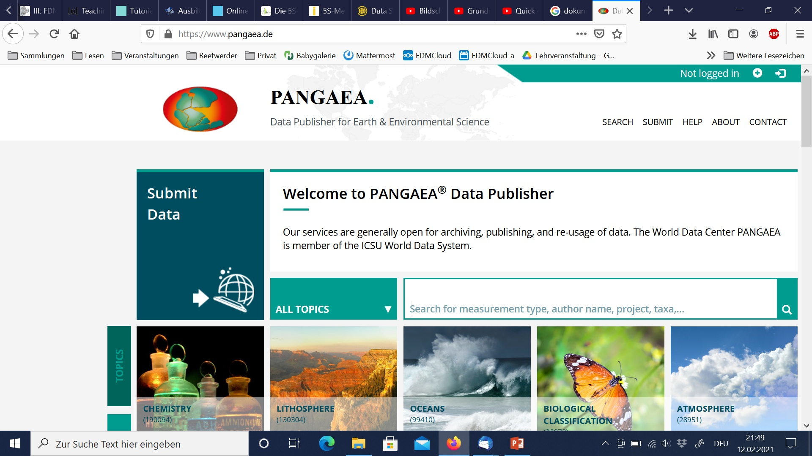

</div>

<div style="float:right; width:45%;">

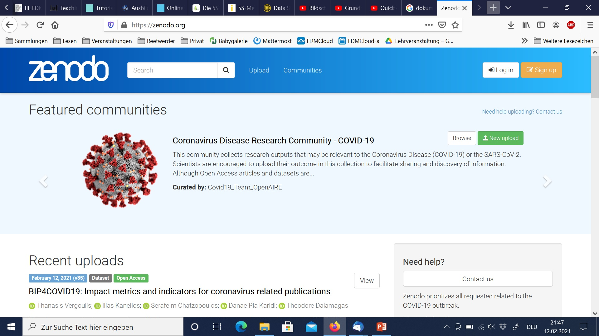

</div>

*********************


{{1}}
********************
> Data journals
********************

{{4-5}}
***************************

- publish detailed description of data

- partly peer-reviewed

Example:

<div style="float:left; width:45%;">
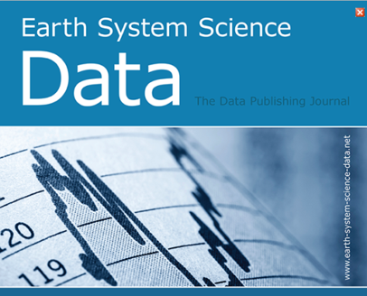

</div>

<div style="float:right; width:45%;">

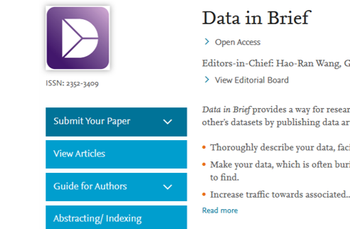

</div>

***************************

### Repositories
{{0-2}}
**What is a repository?**

{{1-2}}
****************
>*"A repository (Latin repositorium, 'storehouse') is a managed place for storing ordered documents that are accessible to the public or to a restricted group of users.An archive (Latin archivum, file cabinet'), on the other hand, manages only historical documents.“*
>
>*"Digital research data repositories are information infrastructures that store and organize digital research data...as permanently as possible...to ensure the discoverability and accessibility of the data...“*
>
>^Source: Esther Asef, Katarzyna Biernacka, Elisabeth Böker,Sarah Ann Danker, Juliane Jacob, Janna Neumann, Britta Petersen, Jessica Rex und Ute Trautwein-Bruns (2021): Data Sharing interaktiv vermitteln^

************************

{{2-5}}
**How to find a repository**

{{3-4}}
***************

<div style="float:left; width:45%;">

**re3data.org**

- Collection of repositories
- Worldwide
- Various disciplines
- Researchers, funders, publishers and institutions

</div>

<div style="float:right; width:45%;">

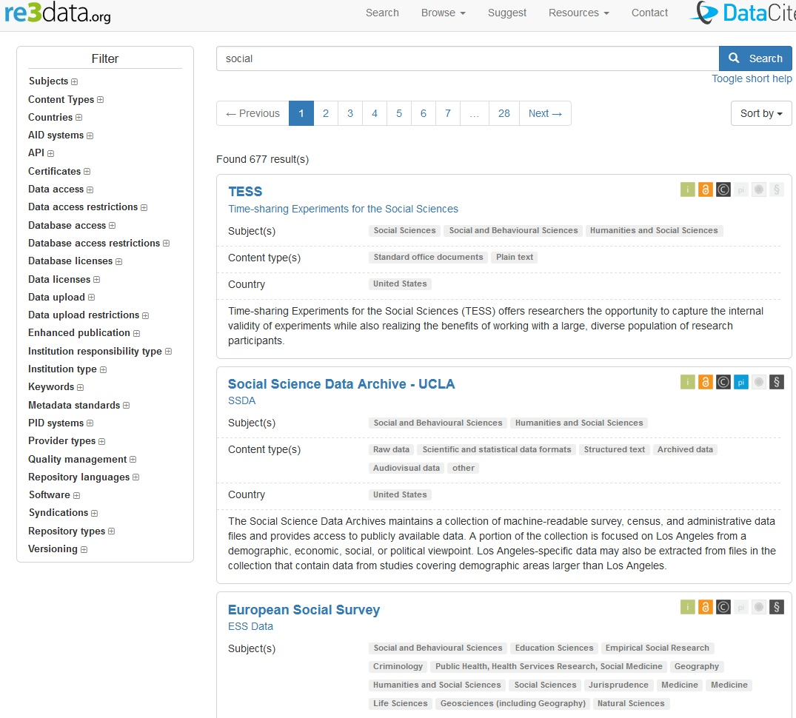

</div>

***************

{{4-5}}
*************

<div style="float:left; width:45%;">

**risources.dfg.de**

- Offer of the DFG
- Information portal
- Germany-wide
- Research Infrastructures
- For researchers

</div>

<div style="float:right; width:45%;">

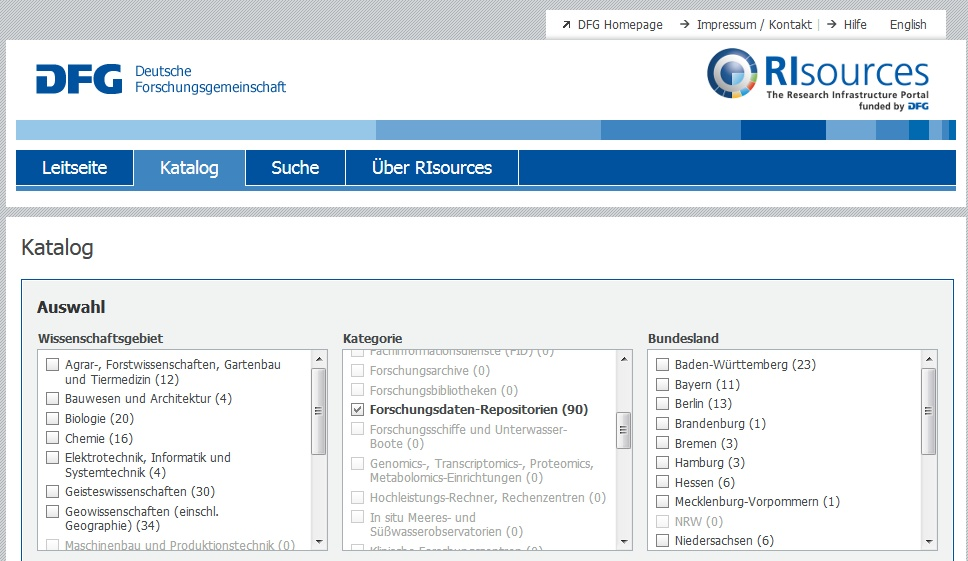

</div>

************

{{5}}
**************

>__Individual work__
><!--
style="width: 20%; max-width: 800px; float:right"
title="working"
onclick="alert('Individual work');"
-->
> Search **re3data.org** for a repository that is appropriate for your data.
>
>Let us discuss your search and selection.

*****************

### Licences
{{0-1}}
*******************
- Licenses regulate conditions of subsequent use of published data.
- Free licenses allow the use, redistribution and modification of copyrighted works

  - are usually available for free use and only need to be linked to
  - Prerequisite is that you are the copyright holder


Selection of the license depends on the type of data:

  - e.g. Creative Commons (CC) licenses for articles, monographs, images, etc.

  - Open-Database-License (ODbL) for DB or CC starting with version 4

  - General Public Licence (GNU) for software

- If no license is granted, the stricter copyright applies, as far as applicable to data

***********
{{1-2}}
******************
> CC-Licenses

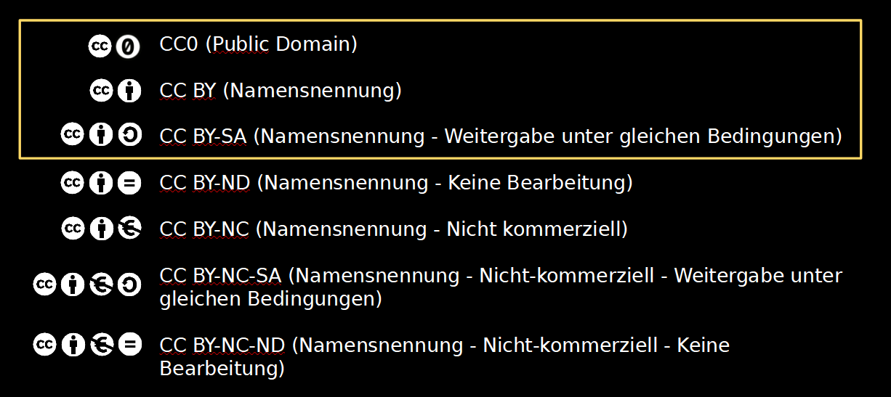 <!-- width="500px" -->

*********************

{{2-3}}
************
**Take care!**

>$$
no\,license
\not =
free\,license
$$

********************

## Data management plan (DMP)

> What is a data management plan?

{{1-2}}
**********
- All information that adequately describes and documents the collection, processing, storage, archiving, and publication of research data in the context of a research project.

- "[...] analysis of the workflow from the generation of the data to their use.“^1^

^[1] J. Ludwig, H. Enke (Hrsg.) Leitfaden zum Forschungsdaten-Management. Handreichungen aus dem WissGrid-Projekt. Verlag Werner Hülsbusch: Glückstadt, 2013.^

***********

> Components of a DMP

{{2-3}}
**********
- Administrative information

  - Project name, data originator, other contributors, contact, funding program, etc.

- Project abstract

  - Data set descriptions
  - Data types, formats, scope
  - Metadata and standards information
  - Data sharing
  - Archiving and backup of data
  - Responsibilities
  - Legal and ethical aspects (e.g., licences, GDPR, Nagoya protocol, CARE)
  - Costs


Length can vary from a few paragraphs to several pages!


*********

### Sketching out a DMP

>__Individual work__
><!--
style="width: 20%; max-width: 800px; float:right"
title="working"
onclick="alert('Individual work');"
-->
>
>Download the CAU template for data management plans: [CAU\_DMP\_Template](https://lms.uni-kiel.de/m/278602a45da821a97539679f1cc25dc4/CAU_DMP_Template_1.1.2.rtf)
>
>Have look at the template and try to sketch out a DMP for your research project.
>
> * What information do you already have?
> * What information is missing to fill the template?

## RDM related organisations & funder requirements

{{0-1}}
************
>**Research Data Alliance**

>**Nationale Forschungsdateninfrastruktur (NFDI)**

>**Deutsche Forschungsgemeinschaft (DFG)**

> **Horizon 2020 & Horizon Europe**

************

{{1-2}}
************

>**Research Data Alliance**

************

{{1-2}}
************

<div style="float:left; width:60%;">

- International organisation founded in 2012

  - __Vision__: Researchers and innovators openly share data across technologies, disciplines, and countries to address the grand challenges of society

  - __Mission__: RDA builds the social and technical bridges that enable open sharing of data

- __Bottom-up__ development of practices, infrastructures, tools, technologies, services, approaches, policies, etc.
- __Practitioners__ come together in [Birds of a Feather-Groups (BoF)](https://www.rd-alliance.org/groups/creating-and-managing-rda-groups/creating-or-joining-birds-feather-group), [Interest Groups (IG)](https://www.rd-alliance.org/groups/interest-groups) or [Working Groups (WG)](https://www.rd-alliance.org/groups/working-groups)
- Regional chapters, e.g., [RDA Europe](https://www.rd-alliance.org/rda-europe) or [RDA Deutschland e.V.](https://www.rda-deutschland.de/)
- Strong __influence__ on European Commission, BMBF, DFG, …

</div>

<div style="float:right; width:20%;">

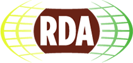

</div>


*****************

{{2-3}}
************

>**Nationale Forschungsdateninfrastruktur (NFDI)**

************

{{2-3}}
*****************

<div style="float:left; width:60%;">

- National research data management initiative in Germany
- Initiated by the [German Council for Scientific Information Infrastructures](http://www.rfii.de/en/home/)

- Horizontal linking of existing actors

  - Discipline-specific [NFDI consortia](https://www.nfdi.de/konsortien-2) with with binding roadmaps

  - Bring into use existing infrastructure

  - Identify and fill gaps
- Interoperability of data and infrastructure

- Use of NFDI will probably get mandatory
- Participation in the work of NFDI consortia possible

</div>

<div style="float:right; width:20%;">


</div>

********************

{{3-4}}
************

>**Deutsche Forschungsgemeinschaft (DFG)**

************

{{3-4}}
****************
<div style="float:left; width:60%;">

- Code of Conduct:
  [Guidelines for Safeguarding Good Research Practice](https://www.dfg.de/en/research_funding/principles_dfg_funding/good_scientific_practice/index.html)
- Guideline 7 – Quality assurance

  - Disclosing of origin of data, organisms, materials and software used
  - Reuse of data is clearly indicated; original sources are cited
  - Description of nature and  scope of research data generated
  - Handling of research data in accordance with requirements of relevant subject area

- Guideline 13 – Public access

  - Making available research data where possible and reasonable

  - Making available software programmed by researchers with source code
- FAIR Principles

</div>

<div style="float:right; width:20%;">


</div>


*****************

{{4-5}}
************

> **Horizon 2020 & Horizon Europe**

************

{{4-5}}
*****************

<div style="float:left; width:60%;">

- Framework Programme for Research and Technological Development of the European Comission

  - [Horizon 2020 Online Manual – Data Management](https://ec.europa.eu/research/participants/docs/h2020-funding-guide/cross-cutting-issues/open-access-data-management/data-management_en.htm)

  - [Horizon Europe – Programme Guide – Open Science](https://ec.europa.eu/info/funding-tenders/opportunities/docs/2021-2027/horizon/guidance/programme-guide_horizon_en.pdf#page=38)

  - [Horizon Europe – Data Management Plan Template](https://ec.europa.eu/info/funding-tenders/opportunities/docs/2021-2027/horizon/temp-form/report/data-management-plan-template_he_en.docx)

- Open access to research data is applicable by default

  - as open as possible, as closed as necessary
- Make research data findable, accessible, interoperable and re-usable (FAIR)

- DMP should include information on:

  - The handling of research data during & after the end of the project

  - What data will be collected, processed and/or generated

  - Which methodology & standards will be applied

  - Whether data will be shared/made open access and

  - How data will be curated & preserved (including after the end of the project)

  </div>

  <div style="float:right; width:20%;">

  

  </div>

******************


## RDM @ CAU


{{0-1}}
************
>__Individual work__
><!--
style="width: 20%; max-width: 800px; float:right"
title="working"
onclick="alert('Individual work');"
-->
>
>You have 5 minutes to perform an internet search!
>
>Are there any guidelines for handling research data at CAU?
>
>Are there specific guidelines for handling research data at your institute?
>
>Who are the contact persons at CAU and/or your institute if you have questions about handling your digital research data?

*************

{{1-2}}
***********
CAU Guideline on Research Data Management

[Kiel University’s Recommendations on Handling Research Data](https://www.praesidium.uni-kiel.de/de/dokumente/leitlinie-zum-umgang-mit-forschungsdaten-guideline-on-research-data-management-english)
---
- __Research data__ are the __basis and result__ of scientific work and are therefore of particular significance. It is important to handle research data responsibly to ensure that __scientific work is traceable, verifiable and reusable__
- Handling research data is __subject to constant__ change due to __advances in research__
- Kiel University continuously assists with this ongoing process by implementing appropriate measures

************

{{2-3}}
************
Principle 1
---
- __Research data__ are __all data created in the process of research work__ through observation, collection, experiments, simulation, and further processing for the __purpose of producing and validating research results__
- __Research data management__ covers __all areas of data administration__: data acquisition, data preservation, data security and data integrity, as well as the release and publication of data

**************

{{3-4}}
************
Principle 2
---
- Research data management is performed in accordance with current professional standards while respecting the DFG (German Research Foundation) proposals for safeguarding good scientific practice
- Research data management is documented in a data management plan
- __Responsibility__ for research data management lies with the head of the particular research activity.

*************
{{4-5}}
***********
Principle 3
---
- Research data is made accessible to the public in national or international subject-specific archives under appropriate licensing; if no such archives exist, central university services are used
- __Scientific and legal interests__ of the researchers, the protection of the personal details of participants, patients and other individuals affected by the collected data, as well as other __obligations to third parties__ – for example, cooperation partners – as well as ethical, legal and economic restrictions __must be observed__
- __Kiel University assists researchers__ through its __central infrastructure facilities__

  - Acquisition and preservation of research data

  - Formulating and maintaining standards for handling research data

  - Appropriate training and advisory service offers created in cooperation with the specialist disciplines

- Kiel University recommends and assists with anchoring the significance of subject-specific, structured research data management in teaching by the particular subject areas

************

## Take-Away Messages

> Practical Take-Away Messages
---

1. <p style="color:#9a047f">**Document your data**</p>

{{1-2}}
************
- Use documented naming and versioning conventions

- document changes

- think about metadata necessary to understand your data

*************

2. <p style="color:#9a047f">**Formats**</p>

{{2-3}}
************
  - __Generic and open standard file formats__ last longer than proprietary file formats

    - Open Document Format (ODF)

    - Comma separated values (CSV)

    - Raw text files (TXT, MD)

  - __Data container formats__ for __exchange, archival and publication__, e.g., [BagIt](https://tools.ietf.org/html/rfc8493), [Frictionless Data](https://frictionlessdata.io/)

*************

3. <p style="color:#9a047f">**Storage**</p>

{{3-4}}
**********
  - __Central infrastructure with backup__ for storage

  - Desktop and laptop for work on current research data only

  - Systematic file and folder naming and hierarchy

  - Provide _Readme_ files

  - Data Management Middleware for handling data and metadata, e.g., [iRODS](https://irods.org/)

  - DFG [Guidelines for Safeguarding Good Research Practice](https://www.dfg.de/en/research_funding/principles_dfg_funding/good_scientific_practice/index.html)  require 10 years of preservation at least!

************

4. <p style="color:#9a047f">**Publication**</p>

{{4-5}}
************
  - Discipline-specific Repositories with specific metadata support

    - [re3data: Registry of Research Repositories](https://www.re3data.org/)

  - National or international initiatives

    - NFDI (work in progress)

    - [European Open Science Cloud Services](https://marketplace.eosc-portal.eu/services/c/sharing-discovery)

  - Institutional Data Repository (work in progress)

  - Generic Repositories

    - [Zenodo](https://zenodo.org/)

************

5. <p style="color:#9a047f">**Licensing**</p>

{{5-6}}
**************
  - [Creative Commons](https://creativecommons.org/): data with a necessary creation height; ideally CC0 or CC BY

- [Open Data Commons](https://opendatacommons.org/): databases, raw data

**********

## Questions

>**Nearly done!**
> <!--
style="width: 20%; max-width: 800px; float:right"
title="puzzle"
onclick="alert('Questions?');"
-->
>
>Time for open questions!

## One Minute Paper

>  __Individual work__
><!--
style="width: 20%; max-width: 800px; float:right"
title="working"
onclick="alert('Individual work');"
-->
>
>Please take a piece of paper or create an own pad (e.g. https://zumpad.zum.de/).
>
>You have one minute.
>
>Please write down the most important points of our workshop today.

## Feedback

>**Please give us some feedback!**
>
> You have a date with some friends tonight.
>
>Your friends remember that you attended a workshop on research data management today and asks: “Well, how was it”?
>
>What do you answer?
>
> | :-)  | :-/  | :-(  |


## CAU contacts

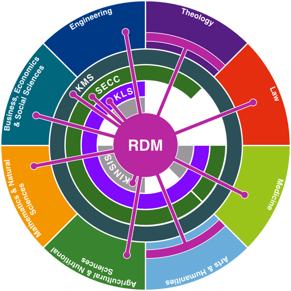 <!-- width="250px" align="right" -->

**RDM contacts at CAU**:

https://www.fdm.uni-kiel.de/de/team

## Thank you!

:-)
